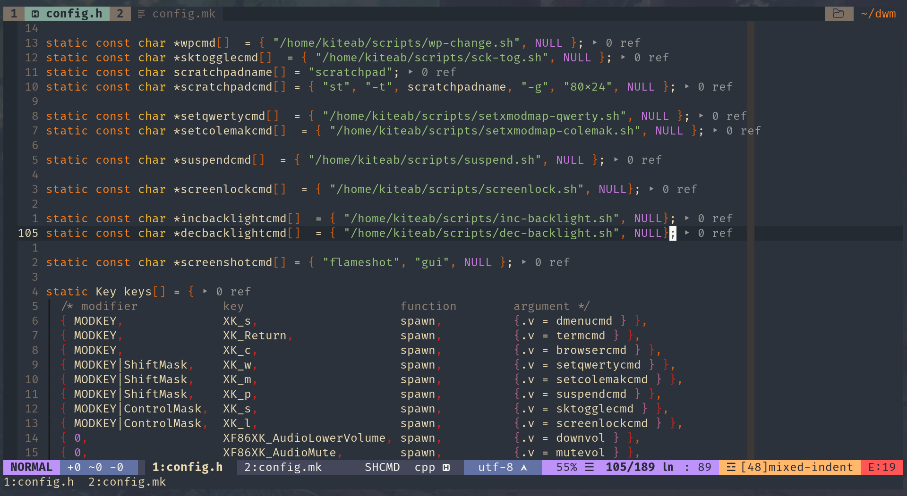

# My Neovim Configuration

This repository has my personal NeoVim configuration files. (I'm a [colemak](https://www.colemak.com) user.)

If you not understand this NeoVim configuration, please don't use it. Otherwise you may have some problems.




## Guide

- [Before Using](#before-using)
- [Key mappings](#key-mappings)
- [Other related projects](#other-related-projects)


## Before using

- [ ] Install `pynvim` (pip)
- [ ] Install `nodejs`, and do `npm install -g neovim`
- [ ] Install nerd-fonts (actually it's optional but it looks real good)

### To check the "health"

You can run `:checkhealth` in vim to check if your NeoVim work well.

### For Python Debugger (via `vimspector`)
- [ ] Install `debugpy` (`pip`)

### Config `Python` path
- [ ] Well, make sure you have python
- [ ] See `_machine_specific.vim`

### For Taglist:
- [ ] Install `ctags` for function/class/variable list

### For FZF
- [ ] Install `fzf`
- [ ] Install `ag` (`the_silver_searcher`)

### And also...
- [ ] Install `figlet` for inputing text ASCII art
- [ ] Install `xclip` for system clipboard access (`Linux` and `xorg` only)


## Key mappings

### Movements

Up, down, left, right to use:

```
    ^
    u
< n   i >
    e
    V
```

Move cursor 5 times to use:

```
    ^
    U
< N   I >
    E
    V
```
Info: the `N` and `I` are move cursor to line the first and the end.

### Other keys

| Keys | Features                 |
|------|--------------------------|
| k    | Insert                   |
| K    | Insert to the line first |
| l    | Undo                     |
| L    | Undotree (a plugin)      |

## Other related projects

- [dwm](https://github.com/KiteAB/dwm)
- [st](https://github.com/KiteAB/st)
- [scripts](https://github.com/KiteAB/scripts)
- [.config](https://github.com/KiteAB/.config)
